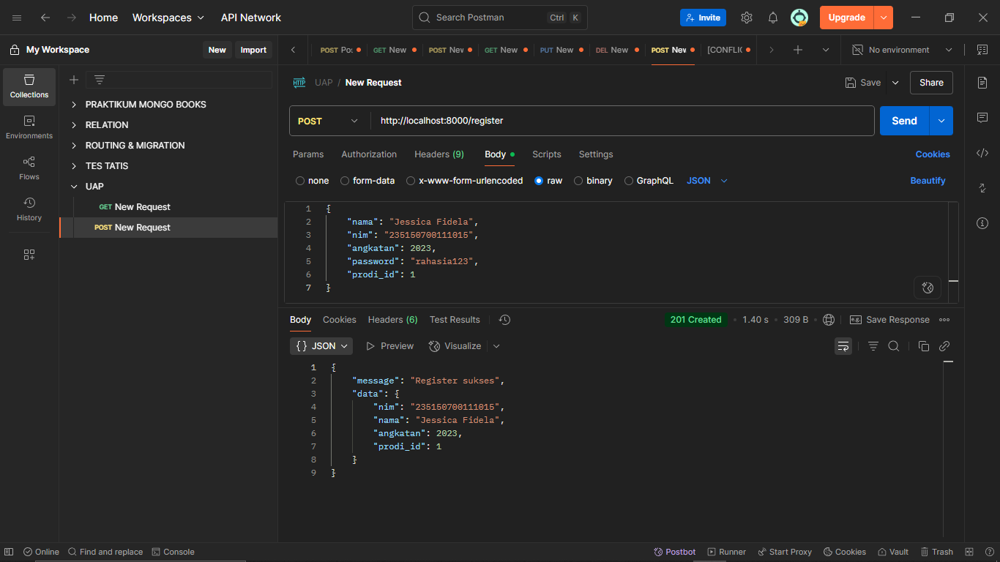
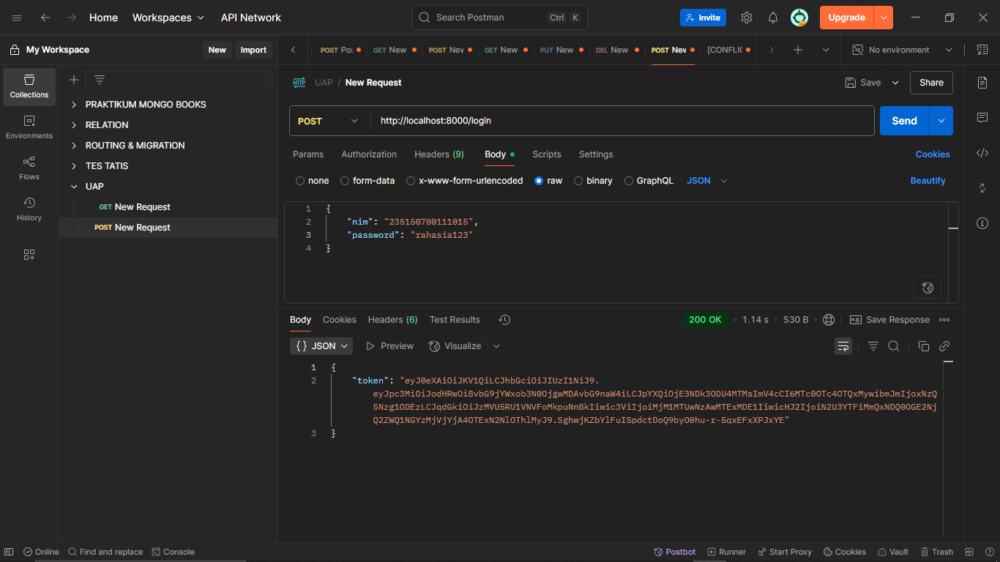
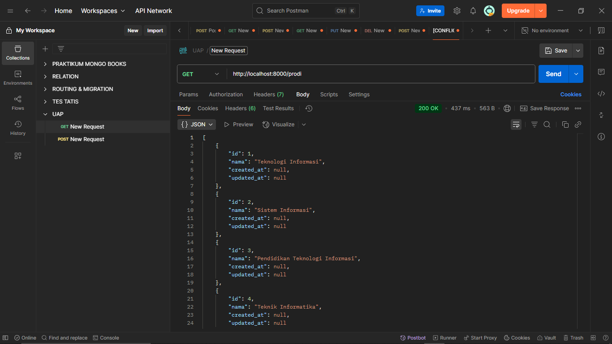
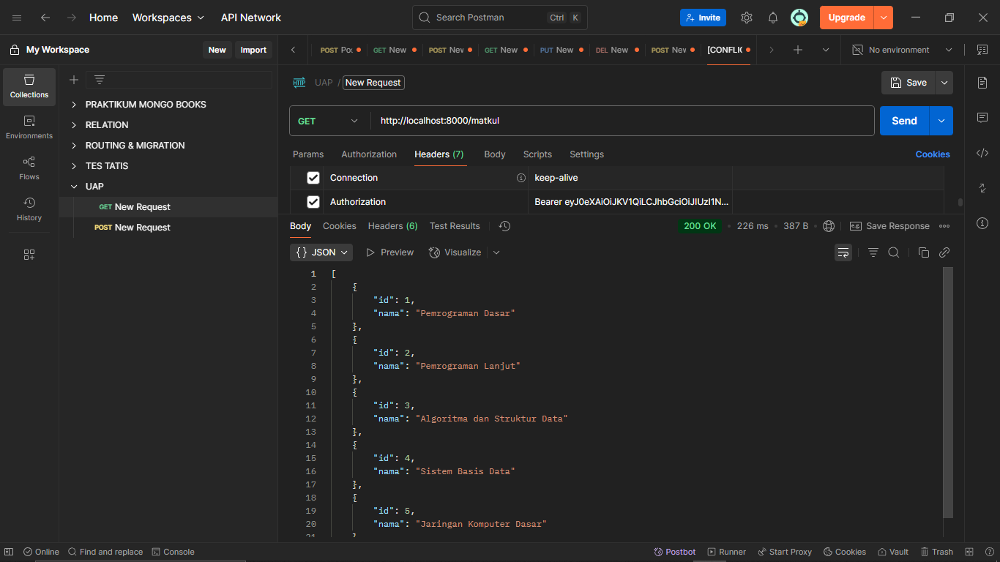
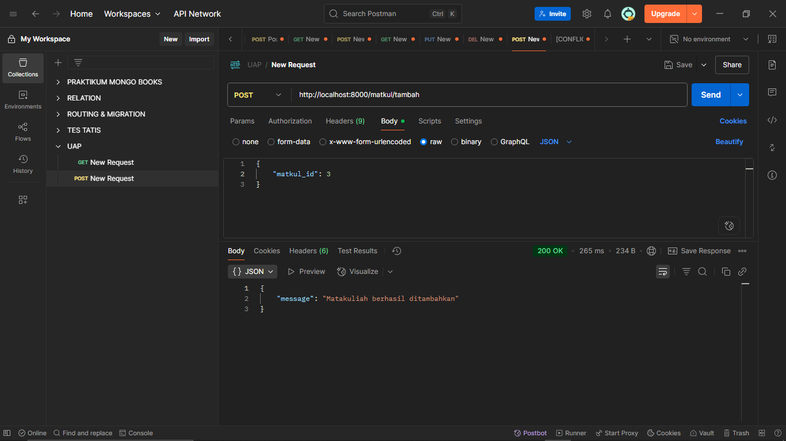
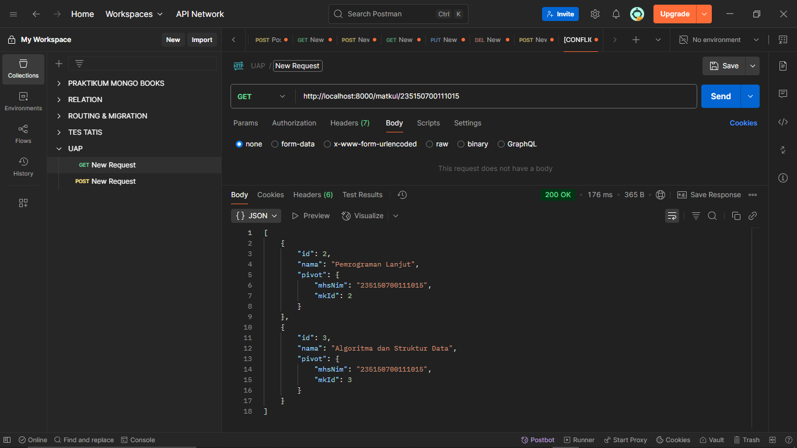
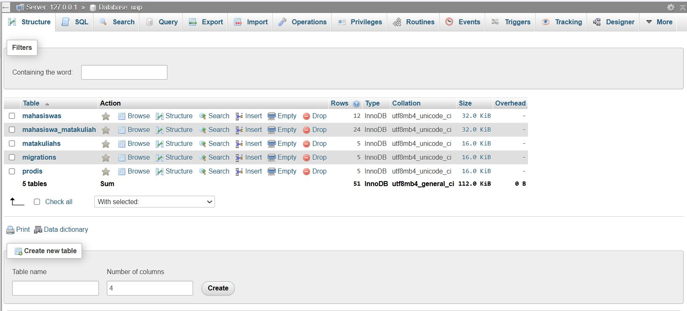

# **TIS-UAP-Expert**

## **Nama Anggota Kelompok:**
- Ayudya Nandira Afifah (235150707111020)
- Jessica Fidela (235150700111015)

## **Kontribusi Anggota:**
### _**Jessica :**_
- Membuat migrations untuk tabel mahasiswas, matakuliahs, dan mahasiswa_matakuliah
- Membuat seeder (MahasiswaSeeder.php, MatakuliahSeeder.php, MahasiswaMatakuliahSeeder.php) untuk mengisi tabel mahasiswas, matakuliahs, dan mahasiswa_matakuliah
- Membuat model (Mahasiswa.php, Matakuliah.php, MahasiswaMatakuliah.php) untuk merepresentasikan tabel mahasiswas, matakuliahs, dan mahasiswa_matakuliah
- Membuat middleware Authenticate.php
- Membuat controller AuthController.php dan MatkulController.php
- Membuat dan mendefinisikan endpoint berikut ke dalam web.php:
  1. POST /register
  2. POST /login
  3. GET /matkul
  4. POST /matkul/tambah
  5. GET /matkul/nim
- Melakukan uji coba untuk seluruh endpoint di atas

### _**Ayudya :**_
- Membuat migrations untuk tabel prodis dan migrations untuk menambahkan foreign key prodi_id pada tabel mahasiswas
- Memodifikasi MahasiswaSeeder.php untuk mengisi tabel mahasiswas dengan atribut tambahan yaitu foreign key prodi_id
- Memodifikasi model Mahasiswa.php untuk menambahkan relasi tabel mahasiswas dengan tabel prodis dan membuat model Prodi.php untuk merepresentasikan tabel prodis
- Membuat controller MahasiswaController.php dan ProdiController.php
- Membuat dan mendefinisikan endpoint berikut ke dalam web.php:
  1. GET /mahasiswa
  2. GET /mahasiswa/prodi/{id}
  3. GET /prodi
- Melakukan uji coba untuk seluruh endpoint di atas
- Melakukan editing video presentasi

## **Dokumentasi Endpoint (ss Postman):**
1. POST /register

3. POST /login

4. GET /mahasiswa

5. GET /prodi

6. GET /mahasiswa/prodi/{id}

7. GET /matkul

8. POST /matkul/tambah

9. GET /matkul/nim

## **Link Video Presentasi:**

## **ERD DB dan SS DB:**
1. ERD DB

2. SS DB

